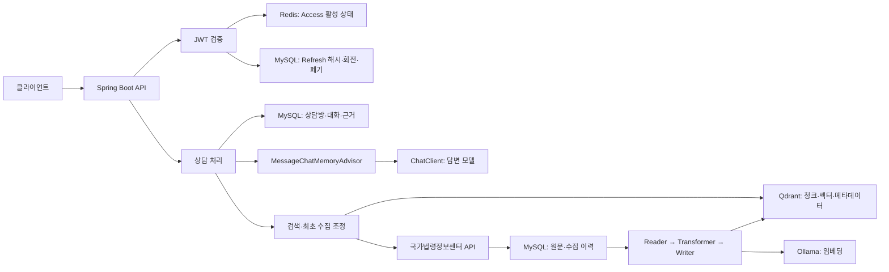

# MoleLaw Backend

**몰루로 묻고 법으로 답하다.** MoleLaw는 사용자의 법률 질문에 관련 법령과 판례 정보를 연결해 답변하고, 상담방에 대화를 저장하는 법률 검색·AI 상담 백엔드입니다.

현재 Java 17·Spring Boot 3.5·Spring AI 기반으로 백엔드를 재구축하고 있습니다. 법령 수집부터 벡터 검색, 대화 맥락 유지, 토큰 인증까지 역할을 분리하고 검증 가능한 구조로 바꾸는 것이 목표입니다.

> 이 README는 2026-10-07 기준입니다. 아래의 현재 구현과 재구축 계획을 구분해 읽어 주세요. Qdrant·Redis 컨테이너 구동이 애플리케이션 검색·인증 전환 완료를 의미하지는 않습니다.

## 주요 기능

- 이메일·비밀번호 회원가입과 로그인, Google OAuth 로그인
- 사용자별 상담방 생성·목록 조회·메시지 조회·삭제
- 최초 질문의 법령 유사도 검색·판례 목록 조회와 AI 답변 생성
- USER·BOT·INFO 구분과 메시지 암호화 저장
- JWT 인증과 상담방 소유권 검사
- Swagger UI를 통한 API 확인

Kakao OAuth 설정은 별도 `kakao` 프로필로 분리되어 있습니다. 기본·로컬 실행에서는 Google 설정을 사용합니다.

## 현재 구현과 바뀔 구조

| 영역 | 현재 구현 | 재구축 방향 |
| --- | --- | --- |
| AI 호출 | Spring AI 1.0.9 ChatClient·EmbeddingModel 통합 | 상담·보조 호출 분리, Advisor와 구조화 답변·출처 검증 |
| 법령 수집 | 첫 페이지 중심 조회와 부족 시 fallback | 최초 질문에서 다음 페이지·다른 법령 후보 수집, 이력·실패 재개 |
| 임베딩 | OpenAI 모델, MySQL 임베딩 테이블 저장 | Ollama 모델 비교 후 Spring AI ETL·Qdrant 색인으로 전환 |
| 검색 | 전체 임베딩 조회 후 코사인 유사도 직접 계산 | Qdrant 벡터 검색·필터·중복 제거·조문 맥락 확장 |
| 후속 상담 | 최초 assistant 답변과 현재 질문 전달 | MessageChatMemoryAdvisor로 채팅방 기록과 최초 원문 근거 전달 |
| Access | 서버 등록 상태 확인 없는 JWT | Redis에 jti·로그인 세션 활성 상태와 TTL 관리 |
| Refresh | 서버 저장·회전 없이 쿠키와 JSON에 전달 | MySQL 별도 테이블에 해시·회전·폐기 이력 관리 |

MySQL·Qdrant 프로필과 H2 테스트 구성, 공통 AI 호출, 기본 법령 수집 회귀 테스트는 구현되어 있습니다. Redis는 Compose와 인증·쓰기·TTL 검증까지 완료했으며 Spring Redis·JWT 연동은 아직 구현 전입니다.

## 목표 아키텍처

다음 그림은 재구축 후 목표 구조입니다.



MySQL 원문은 기준 데이터이며 Qdrant 색인은 재생성 가능한 검색 데이터로 관리합니다. Redis 인증 상태와 Advisor 대화 메모리는 별개입니다. 상담방 conversationId와 로그인 sessionId도 구분합니다.

## 법령 ETL과 RAG 계획

Spring AI의 `DocumentReader → DocumentTransformer → QdrantVectorStore` 구조로 법령 자료를 읽고, 조문 구조를 보존해 나눈 뒤 임베딩·색인합니다. 법령 ID/MST, 조·항·호·목 경로, 원문 링크, 수집 시각과 내용 해시를 보존합니다. 안정적인 청크 ID와 색인 버전으로 중복·변경·삭제·재실행을 관리합니다.

**최초 질문**에서는 기존 색인을 검색하고, 근거가 부족하면 같은 검색 조건의 다음 페이지나 다른 법령 후보를 수집합니다. 새 자료를 ETL·색인한 뒤 재검색해 같은 질문의 답변에 반영합니다. 고정 2라운드 제한을 두지 않고 근거 확보, 탐색 소진, 설정한 시간·호출·임베딩 예산으로 종료합니다.

**후속 질문**에서는 Advisor가 채팅방 기록을 전달하고 최초에 저장한 근거 스냅샷으로 답변합니다. 추가 수집·색인·법령/판례 검색은 하지 않습니다. 기존 근거 밖의 새로운 쟁점은 한계를 설명하고 새 상담방에서 다루도록 안내합니다.

판례는 쟁점 기반 검색 후 상세 내용과 관련성을 검증한 자료만 채택할 계획입니다. 이전 assistant 답변이나 판례 제목만을 법률 원문 근거로 취급하지 않습니다. 최종 답변의 근거 ID·출처를 서버에서 검증한 후 성공한 대화 턴을 확정합니다.

## Ollama 임베딩 비교 계획

모델과 청크 크기는 아직 확정하지 않았습니다.

| 비교군 | 기본 벡터 차원 | 역할 |
| --- | --- | --- |
| bge-m3 | 1,024 | 다국어 검색 기준선 |
| qwen3-embedding:0.6b | 1,024 | 소형 모델의 검색 품질 비교 |
| embeddinggemma | 768 | 로컬 자원 부담과 검색 품질 비교 |

먼저 동일한 512토큰 기준 청크와 평가 질문 30~50개로 모델을 비교합니다. 이후 선정한 모델에서 청크 상한 256·512·1,024토큰을 비교합니다. 법령 10~30개·청크 1만 개 이하·동시 임베딩 1개부터 실험하고 Recall@K, 무관한 결과 비율, 지연시간, 색인 시간과 메모리를 측정합니다.

모델별 토크나이저·질문/문서 입력 형식·실제 출력 차원을 확인합니다. 모델별 Qdrant 컬렉션을 분리하며 같은 차원이어도 서로 다른 모델 벡터를 섞지 않습니다. 답변 모델은 우선 외부 API를 유지하고 Ollama는 임베딩 후보로 도입합니다.

zero-shot RAG 기준선을 확보한 뒤 one-shot 답변 예시와 step-back 검색 전략을 각각 비교합니다. one-shot은 답변 예시 한 개를 넣는 방식이며 최종 답변 호출 횟수와는 다른 개념입니다.

## 인증 보안 개선 계획

Access는 짧은 수명의 JWT를 유지하고 Redis의 활성 토큰·세션 상태를 매 요청 확인할 계획입니다. Redis 키가 없거나 장애가 발생하면 JWT 검증만으로 우회하지 않습니다. Refresh는 MySQL 별도 테이블에 원문 대신 해시를 저장하고 재발급 시 회전·재사용 탐지·폐기를 수행합니다.

브라우저 Refresh는 HttpOnly 쿠키로 전달하고 JSON 응답에서는 제거할 예정입니다. Secure·SameSite·Path·수명 설정을 통일하며 Access/Refresh 용도 분리, 토큰 로그 제거, CORS 허용 목록과 CSRF 보호를 함께 적용합니다. 로그아웃은 서버 인증 상태를 폐기하지만 상담 기록은 보존합니다.

현재 Access 만료식은 **15시간**, Refresh는 **7일**이며 서버 폐기·회전은 아직 없습니다. Access **15분**은 재구축 초기 제안입니다. 현재 재발급 경로는 Access 인증을 요구하므로 만료 Access 없이 정상 Refresh로 재발급되도록 변경할 예정입니다. 세부 검토는 [JWT 보안 검토](docs/jwt-security-review.md)를 참고하세요.

## 기술 구성과 디렉터리

| 구분 | 구성 |
| --- | --- |
| 언어·빌드 | Java 17, Gradle Wrapper |
| 서버 | Spring Boot 3.5.0, Spring MVC, WebClient |
| 데이터·인증 | Spring Data JPA, Spring Security, OAuth2 Client, JJWT |
| AI | Spring AI 1.0.9, OpenAI ChatClient·EmbeddingModel |
| 로컬 인프라 | MySQL 8.4.11, Qdrant v1.19.1, Redis 7.4.11-alpine |
| 테스트·문서 | JUnit Jupiter, Mockito, Spring Security Test, H2, springdoc |

```text
src/main/java/com/MoleLaw_backend/
├── controller/          HTTP API
├── service/
│   ├── ai/              공통 AI 호출·프롬프트
│   ├── chat/            상담방·메시지·후속 답변
│   ├── law/             법령 수집·임베딩·검색·판례
│   ├── security/        JWT·쿠키·인증 필터
│   ├── oauth/           OAuth 로그인
│   └── user/            사용자 관리
├── domain/              JPA 엔티티·Repository
├── dto/                 요청·응답 모델
├── config/              저장소·보안·AI 설정
├── exception/           공통 예외 처리
└── util/                법령 파싱·메시지 암호화
src/main/resources/      프로필 설정·프롬프트
src/test/                테스트·법령 응답 fixture
docker/                  Compose·환경변수 예제·검증 스크립트
docs/                    재구축 계획·기준선·보안 검토
```

## 로컬 실행

JDK 17과 Linux containers 모드의 Docker Desktop을 준비합니다. 기존 환경변수 파일이 있으면 덮어쓰지 않고 필요한 항목만 추가합니다.

```powershell
# 저장소 루트에서 실행. 두 대상 파일이 없을 때만 복사합니다.
Copy-Item .env.example .env
Copy-Item docker/.env.compose.example docker/.env.compose
```

`.env`에는 DB·OAuth·OpenAI·OpenLaw·JWT 설정을, `docker/.env.compose`에는 MySQL 비밀번호·Qdrant API 키·Redis 비밀번호를 입력합니다. 같은 서비스의 비밀값은 두 설정에서 일치시킵니다. Redis 비밀번호는 32자 이상의 무작위 영문·숫자·밑줄·하이픈을 사용합니다. 비밀값은 커밋하지 않습니다.

```powershell
docker compose -f docker/compose.yml --env-file docker/.env.compose config --quiet
docker compose -f docker/compose.yml --env-file docker/.env.compose up -d
.\gradlew.bat bootRun --args="--spring.profiles.active=local"
```

기본 주소는 백엔드 `http://localhost:8080`, Swagger `http://localhost:8080/swagger-ui.html`, MySQL `127.0.0.1:3307`, Qdrant HTTP/gRPC `6333/6334`, Redis `6379`입니다.

| 프로필 | 현재 동작 |
| --- | --- |
| 기본 / mysql | MySQL @Primary 데이터소스, 스키마 validate |
| local | mysql + qdrant, 개발 스키마 update, SSL 비활성화 |
| test | H2·더미 인증·모델 모킹, 외부 저장소 없이 테스트 |
| kakao | 필요한 경우 명시적으로 활성화하는 OAuth 설정 |

현재 일반 로그인·가입·재발급의 쿠키 Secure는 true로 고정된 경로가 있어 로컬 설정이 모든 인증 경로에 적용되지는 않습니다. Redis·Ollama 애플리케이션 연동도 아직 없습니다. 준비 상태 검사·자원 예산·LAN 연결·데이터 보존 정책은 [로컬 인프라 가이드](docker/README.md)를 따릅니다.

## 빌드와 검증

```powershell
.\gradlew.bat test
.\gradlew.bat clean build
.\gradlew.bat bootJar
powershell -NoProfile -ExecutionPolicy Bypass -File docker/verify.ps1
```

Gradle 테스트는 실제 모델 호출을 모킹하며 Docker·실제 API 키 없이 실행할 수 있습니다. H2 테스트는 실제 MySQL 통합 검증을 대체하지 않습니다. `verify.ps1`은 실행 중인 컨테이너의 MySQL 쿼리, Qdrant 인증·임시 벡터 검색, Redis 인증·임시 키 쓰기·TTL·삭제를 검사합니다.

2026-10-07 인프라 검증은 세 서비스 모두 통과했습니다. 이전 기준선에는 테스트 20개와 JAR 빌드 통과가 기록되어 있습니다. ETL·Advisor·새 JWT 저장소·실제 모델 품질 검증은 별도 구현 후 진행할 예정입니다.

## 주요 API

| 메서드·경로 | 설명 |
| --- | --- |
| POST /api/auth/signup | 회원가입 |
| POST /api/auth/login | 로그인 |
| GET /api/auth/me | 내 정보 조회 |
| POST /api/auth/reissue | 토큰 재발급 |
| POST /api/auth/logout | 로그아웃 |
| GET /api/chat-rooms | 내 상담방 목록 |
| GET /api/chat-rooms/{roomId} | 상담방 메시지 조회 |
| POST /api/chat-rooms/first-message | 상담방 생성과 최초 질문 |
| POST /api/chat-rooms/{roomId}/messages | 후속 질문 |
| DELETE /api/chat-rooms/{roomId} | 상담방·메시지 삭제 |

질문 입력은 `{"content":"상담 질문"}`이며 최초 응답은 상담방 ID와 메시지 목록, 후속 응답은 BOT 메시지입니다. 세부 계약은 Swagger와 [재구축 기준선](docs/backend-baseline.md)을 참고하세요. Refresh 응답 제거·쿠키 정책·장시간 최초 질문 응답 방식은 구현 시 API 변경 사항으로 문서화합니다.

## 다음 단계

1. 기준선·권한·인증 보안 점검과 스키마 준비
2. Spring AI ETL·다중 페이지 수집·Ollama 임베딩 비교
3. Redis Access·MySQL Refresh 인증 저장소 전환
4. Qdrant 검색·최초 근거 스냅샷·판례 검증 연결
5. Advisor 기반 후속 상담과 출처 검증
6. 검색·답변 품질 비교와 기존 구현 정리

상세 작업 순서·완료 조건·미정 정책은 [백엔드 재구축 계획](docs/backend-rebuild-plan.md)에 관리합니다. JWT에 상담방 목록을 넣는 방안은 검토 단계이며 현재 토큰 claim에 추가하는 것으로 확정하지 않았습니다.

## 관련 문서

- [백엔드 재구축 계획](docs/backend-rebuild-plan.md)
- [JWT 인증 보안 검토](docs/jwt-security-review.md)
- [재구축 전 동작 기준선](docs/backend-baseline.md)
- [로컬 인프라 실행·검증 가이드](docker/README.md)
- [기여 가이드](AGENTS.md)

기존 Dockerfile과 main 푸시 기반 EC2 배포 워크플로는 저장소에 남아 있습니다. 새 Redis 인증·ETL·Ollama 연동의 운영 배포 구성까지 완료한 상태는 아닙니다.
